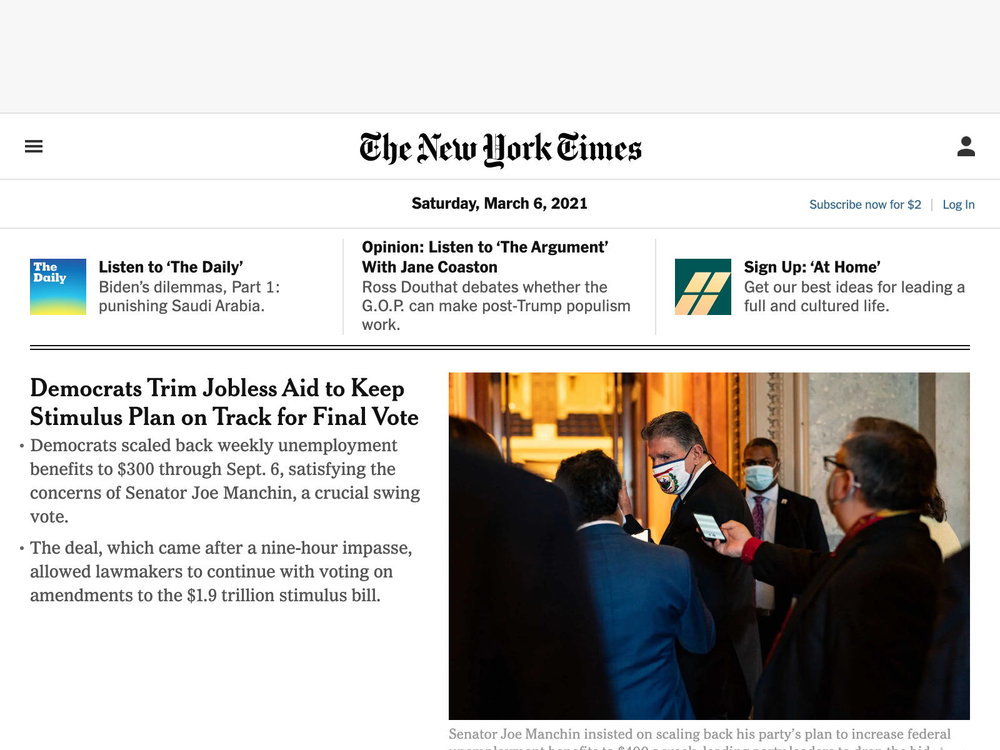

# MakePNG

[](https://goreportcard.com/report/github.com/KingGenius5/makesite)

MakePNG is a ChromeDP CLI that takes a screenshot of any webpage and saves it as a PNG. Currently takes pictures of the NYT front page; you'll have to manually change the URL unti the args update comes along.



### Getting Started

```bash
    $ git clone git@github.com:KingGenius5/makePNG.git
    $ cd makePNG
    $ docker pull chromedp/headless-shell
    $ go build
    $ go run main.go
```

And you'll have a PNG of the NYT front page at your fingertips.

### Presentation

[MakePNG Slide Deck](https://www.canva.com/design/DAEX976XwlE/xZgh8B1uLcbQL4625lMz4w/view?utm_content=DAEX976XwlE&utm_campaign=designshare&utm_medium=link&utm_source=sharebutton)
